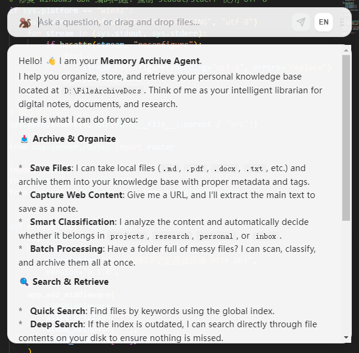

# Memory Archive Agent


[](https://github.com/langchain-ai/langgraph)
[](https://fastapi.tiangolo.com/)
[](https://www.electronjs.org/)

[English](README.md) | **中文文档**

**扔文件、贴链接、输文字 — AI 自动理解、分类、归档到你的个人知识库。**

Memory Archive Agent (MAA) 是一个基于 ReAct Agent 架构的 AI 驱动型桌面知识管理工具。它自动解析、分类并存储你的文档到本地 Markdown + Git 知识库——无需数据库，零厂商锁定。

## 📸 项目截图



---

## ✨ 功能特性

- **智能归档** — 拖入文件或粘贴链接，AI Agent 自动解析、分类，写入带标签和分类的结构化 Markdown 档案
- **自然语言搜索** — 用自然语言提问，Agent 搜索知识库并返回精准答案与文件引用
- **批量处理** — 一次性拖入多个文件，逐个自动归档
- **流式响应** — SSE 实时流式输出，实时显示"解析中 / 分类中 / 归档中 / 完成"状态
- **可点击文件链接** — Agent 返回的 `[file:路径]` 链接可点击，左键打开、右键菜单（打开/定位/复制路径）
- **Git 同步** — 知识库自动版本控制，支持推送/拉取/自动修复
- **跨平台** — 支持 Windows、macOS、Linux
- **开放存储格式** — 纯 Markdown + YAML frontmatter + Git，完全可迁移

## 🏗️ 架构

```
┌─────────────────────────────────────────────────┐
│            桌面应用 (Electron)                     │  ← 你的工作空间
├─────────────────────────────────────────────────┤
│            HTTP API (FastAPI + SSE)              │  ← 流式输出 + REST
├─────────────────────────────────────────────────┤
│     ReAct Agent (LangGraph) ── LLM 自主决策       │  ← 无预设流程
├─────────────────────────────────────────────────┤
│  17+ 工具 ─ 解析 / 归档 / 搜索 / 同步             │  ← 可插拔、独立
├─────────────────────────────────────────────────┤
│     本地存储 ── Markdown + Git (零数据库)          │  ← 文件系统即真理
└─────────────────────────────────────────────────┘
```

### 设计原则

| 原则 | 含义 |
|------|------|
| **Agent 是核心** | LLM 自主选择工具，不预设归档/查询模式 |
| **工具独立** | 即插即用，新增工具只需继承 BaseTool 并注册 |
| **文件系统即真理** | Markdown + Git，格式开放、可迁移、零数据库 |
| **容错优先** | 本地写入优先，断网/LLM 失败不崩溃 |

## 🚀 快速开始

### 1. 环境要求

- Python 3.10+（后端）
- Node.js 18+（前端 / 桌面应用）
- LLM API Key（DashScope、OpenAI、Claude 或任何兼容 OpenAI 接口的提供商）

### 2. 安装

#### 后端

```bash
git clone https://github.com/YOUR_USERNAME/Agent-Memory-Archive.git
cd Agent-Memory-Archive
pip install -e .
```

自动安装的依赖：

| 包 | 用途 |
|----|------|
| `langgraph` + `langchain-*` | ReAct Agent 引擎 |
| `fastapi` + `uvicorn` | HTTP API 服务 |
| `markitdown` | 多格式文件解析 |
| `pydantic` | 数据校验 |
| `click` | CLI 框架 |

#### 前端（桌面应用）

```bash
cd desktop
npm install
```

| 包 | 用途 |
|----|------|
| `electron` | 桌面应用框架 |
| `react` + `react-dom` | UI 框架 |
| `vite` | 构建工具 + 开发服务器 |
| `concurrently` + `wait-on` | 开发流程编排 |

### 3. 配置

MAA 使用两个配置文件：

| 文件 | 用途 | 内容 |
|------|------|------|
| `.env` | 密钥 & 凭据 | API Key、Token 等敏感信息 — **切勿提交到 Git** |
| `config.json` | 应用设置 | LLM 提供商、存储路径、Git 仓库、通道开关 — **可安全分享** |

#### 第一步 — 环境变量（`.env`）

```bash
cp .env.example .env
```

编辑 `.env`，填入你的 API 密钥：

```env
# 必填：LLM API Key
DASHSCOPE_API_KEY=sk-your-api-key-here

# 可选：网页抓取
MAA_FIRECRAWL_API_KEY=your-firecrawl-key-here

# 可选：Bot Token（Phase 3 阶段）
MAA_TELEGRAM_BOT_TOKEN=your-telegram-bot-token-here
MAA_FEISHU_APP_ID=your-feishu-app-id-here
MAA_FEISHU_APP_SECRET=your-feishu-app-secret-here
```

> 也可以通过环境变量覆盖模型和存储路径：`MAA_LLM_MODEL`、`MAA_API_BASE`、`MAA_STORAGE_ROOT`。

#### 第二步 — 应用设置（`config.json`）

```bash
cp config.example.json config.json
```

编辑 `config.json`：

```json
{
  "llm": {
    "provider": "dashscope",
    "model": "qwen3.6-plus",
    "api_base": "https://dashscope.aliyuncs.com/compatible-mode/v1",
    "extra_body": {"enable_thinking": false}
  },
  "storage": {
    "root": "~/MemoryArchive"
  },
  "git": {
    "repo_url": "git@github.com:your-username/agent-memory.git",
    "branch": "main"
  },
  "categories": ["projects", "research", "personal", "inbox"],
  "channels": {
    "cli": { "enabled": true },
    "mcp": { "enabled": false, "port": 3000 },
    "telegram": { "enabled": false },
    "feishu": { "enabled": false }
  }
}
```

| 字段 | 说明 |
|------|------|
| `llm.provider` | LLM 提供商：`dashscope`、`openai`、`claude`，或任意 OpenAI 兼容名称 |
| `llm.model` | 模型名（如 `qwen3.6-plus`、`gpt-4o`、`claude-opus-4-7`） |
| `llm.api_base` | API 端点地址 |
| `llm.extra_body` | 额外请求体（如 Qwen 的 `{"enable_thinking": false}`） |
| `storage.root` | 知识库根目录 |
| `git.repo_url` | Git 远程仓库地址（可选，留空则跳过同步） |
| `git.branch` | Git 分支名 |
| `categories` | 顶层归档分类 |
| `channels` | 各 I/O 通道的启用/禁用及配置 |

> **注意**：API Key 放在 `.env` 中，**不要**写在 `config.json` 里。两个文件在运行时会合并——环境变量优先级更高。

### 4. 启动

```bash
# 启动桌面应用（自动启动后端服务）
cd desktop && npm run electron:dev
```

或者不使用桌面应用，直接使用 CLI：

```bash
python cli.py
```

后端服务启动（桌面应用会自动启动后端）：

```bash
python server.py
# 服务运行在 http://127.0.0.1:8899
```

## 📖 使用说明

### 桌面应用

**快捷键**：<kbd>Ctrl</kbd> + <kbd>Shift</kbd> + <kbd>M</kbd> 呼出，<kbd>Esc</kbd> 隐藏。

1. **归档文件** — 拖拽任意文件（.md, .pdf, .docx, .xlsx, .pptx, .txt）到输入框
2. **归档网页** — 粘贴 URL，Agent 通过 Firecrawl 抓取并提取内容
3. **搜索知识** — 输入问题，如"我关于向量数据库学了什么？"
4. **打开归档** — 点击 Agent 回复中的 `[file:路径]` 链接

### CLI 交互模式

```
> ~/Downloads/paper.pdf
# Agent 解析、分类并归档 PDF

> https://example.com/article
# Agent 抓取网页内容并归档

> 我保存了哪些关于机器学习的资料？
# Agent 搜索知识库并汇总相关文件
```

### REST API

服务在 `http://127.0.0.1:8899` 暴露以下端点：

| 端点 | 方法 | 说明 |
|------|------|------|
| `/chat` | POST | SSE 流式对话（`{message, language}`） |
| `/archive` | POST | 归档内容（`source_path`、`content` 或 `url`） |
| `/search` | GET | 搜索知识库（`?q=关键词`） |
| `/tree` | GET | 获取知识库目录树 |
| `/projects` | GET | 列出项目文件夹 |
| `/files/{path}` | GET | 按路径读取归档文件 |
| `/tools` | GET | 列出所有可用工具 |
| `/open-file` | GET | 用系统默认应用打开文件 |
| `/reveal-file` | GET | 在文件管理器中定位文件 |

交互式 API 文档地址：`http://127.0.0.1:8899/docs`

## 🛠️ 工具列表

Agent 拥有 17+ 个独立工具：

| 类别 | 工具 | 说明 |
|------|------|------|
| **解析** | `parse_file`, `extract_content` | 多格式文件解析（MarkItDown）+ 网页抓取（Firecrawl） |
| **归档** | `archive_file`, `update_index`, `sync_index` | 智能去重写入归档 + 维护双层索引 |
| **搜索** | `search_index`, `read_file`, `list_projects` | 全文搜索、文件读取、项目列表 |
| **导航** | `list_tree`, `list_dir` | 目录树扫描 + 文件夹级摘要 |
| **分类** | `classify_content`, `scan_directory`, `batch_classify`, `batch_archive` | LLM 自动分类 + 批量处理 |
| **Git** | `git_sync`, `git_status`, `git_remote_info` | Git 操作 + 智能自动修复 |
| **导出** | `pull_to_local` | 将知识库文件复制到本地任意目录 |
| **系统** | `code_run` | 安全的只读诊断命令（15 种黑名单模式） |

## 📁 存储结构

```
~/MemoryArchive/
├── .maa/
│   ├── index.json          # 全局机器可读索引
│   └── project_map.json    # 跨文件夹项目映射
├── projects/               # 工程项目
│   └── my-project/
│       ├── .index.md       # 文件夹级索引（人类 + LLM 可读）
│       └── notes.md        # 归档文档，带 YAML frontmatter
├── research/               # 学术研究、论文、技术调研
├── personal/               # 个人背景、偏好、随笔
└── inbox/                  # 未分类暂存区
```

### 双层索引设计

- **全局索引**（`.maa/index.json`）— JSON 格式，支持快速程序化搜索，无需 LLM
- **文件夹索引**（`.index.md`）— Markdown 带 frontmatter，为 LLM 分类提供语义上下文

### 归档文件格式

每个归档文件自动附带 YAML frontmatter：

```yaml
---
type: memory_archive_agent
category: projects
project: my-project
tags: [tag1, tag2]
created_at: 2026-05-18
original_title: Original Filename.pdf
---

# 正文内容...
```

### 智能去重

`archive_file` 工具基于内容重叠评分，防止数据丢失：

| 重叠度 | 处理方式 |
|--------|----------|
| ≥ 95% | 跳过（完全重复） |
| 85–95% | 增量追加（仅添加新行） |
| 40–85% | 完整追加（带时间戳） |
| < 40% | 拒绝并建议新文件名 |

## 🔧 开发

### 项目结构

```
src/maa/
├── agent/        # ReAct Agent 核心（引擎、图、提示词、工具适配）
├── tools/        # 17+ 可插拔工具（解析、归档、搜索、同步等）
├── storage/      # 存储层（仓库管理、双索引、数据模型）
├── channels/     # 输入输出通道（CLI，未来支持 MCP、飞书、Telegram）
├── server/       # FastAPI HTTP API（路由、SSE 流式）
└── config.py     # 配置管理（支持 .env）

desktop/          # Electron 桌面应用（React + TypeScript + Vite）
docs/             # 架构与设计文档
openspec/         # 变更提案（规划中的功能）
```

### 添加新工具

1. 在 `src/maa/tools/` 下创建文件
2. 继承 `BaseTool`，实现 `name`、`description`、`param_schema` 和 `execute()`
3. 在 `src/maa/tools/__init__.py` 中注册

### 运行测试

```bash
pytest tests/
```

## 🗺️ 路线图

| 阶段 | 内容 | 状态 |
|------|------|------|
| **Phase 1** | 核心引擎 + 工具集 + CLI + API + 桌面应用 | ✅ 已完成 |
| **Phase 2** | MCP Server（Claude Code / Cursor 直接调用） | 📋 规划中 |
| **Phase 3** | 飞书 Bot + Telegram Bot | 📋 规划中 |
| **Phase 4** | 浏览器扩展 + 文件监听 + 多模型支持 | 📋 规划中 |

## 📄 许可证

MIT
